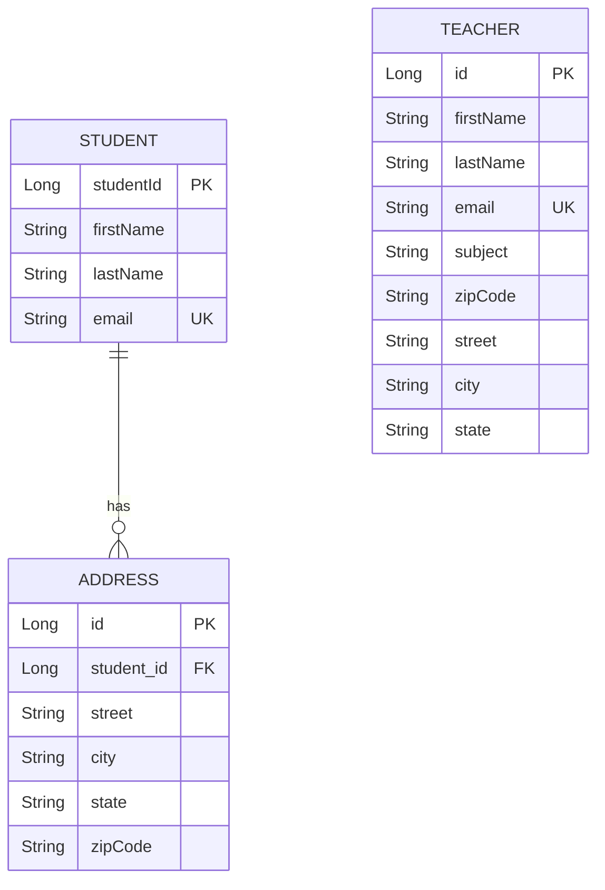

# 🎓 Sistema de Gerenciamento Escolar

<div align="center">


**Um sistema completo para gerenciamento de estudantes, professores e endereços com autenticação OAuth2 via Google.**

[Funcionalidades](#-funcionalidades) •
[Tecnologias](#-tecnologias) •
[Instalação](#-instalação) •
[Uso](#-uso) •
[API](#-api-endpoints)

</div>

---

## 📋 Sobre o Projeto

Este é um sistema de gerenciamento escolar desenvolvido com **Spring Boot**, oferecendo uma interface moderna e responsiva para cadastro e administração de estudantes, professores e seus respectivos endereços. O sistema conta com autenticação segura via **Google OAuth2** e integração com a **API ViaCEP** para preenchimento automático de endereços.

### ✨ Screenshots

<div align="center">

</div>

---

## 🚀 Funcionalidades

### 👨‍🎓 Gestão de Estudantes
- ✅ Cadastro, edição e exclusão de estudantes
- ✅ Validação de e-mail único
- ✅ Interface moderna com design glassmorphism

### 👨‍🏫 Gestão de Professores
- ✅ Cadastro completo com disciplina
- ✅ Endereço integrado ao cadastro
- ✅ Busca automática de CEP via ViaCEP

### 📍 Gestão de Endereços
- ✅ Múltiplos endereços por estudante
- ✅ Integração com API ViaCEP
- ✅ Preenchimento automático (rua, cidade, estado)

### 🔐 Segurança
- ✅ Autenticação OAuth2 com Google
- ✅ Sessões seguras
- ✅ Proteção de rotas

---

## 🛠 Tecnologias

### Backend
| Tecnologia | Versão | Descrição |
|------------|--------|-----------|
| **Java** | 21 | Linguagem de programação |
| **Spring Boot** | 3.5.7 | Framework principal |
| **Spring Data JPA** | - | Persistência de dados |
| **Spring Security** | - | Segurança e autenticação |
| **Spring OAuth2 Client** | - | Login com Google |
| **Lombok** | - | Redução de boilerplate |
| **MySQL Connector** | - | Driver do banco de dados |

### Frontend
| Tecnologia | Descrição |
|------------|-----------|
| **Thymeleaf** | Template engine |
| **HTML5/CSS3** | Estrutura e estilização |
| **JavaScript** | Interatividade |
| **Inter Font** | Tipografia moderna |

### Banco de Dados
| Tecnologia | Descrição |
|------------|-----------|
| **MySQL** | Banco de dados relacional |

---

## 📦 Instalação

### Pré-requisitos

Antes de começar, certifique-se de ter instalado:

- ☕ **Java JDK 21** ou superior
- 🗄️ **MySQL 8.0** ou superior
- 📦 **Maven 3.8+** (ou use o wrapper incluso)
- 🔑 **Conta Google** (para configurar OAuth2)

### Passo a Passo

#### 1️⃣ Clone o Repositório

```bash
git clone https://github.com/seu-usuario/spring-java-vscode.git
cd spring-java-vscode/spring
```

#### 2️⃣ Configure o Banco de Dados

Crie o banco de dados MySQL (ou deixe que o Spring crie automaticamente):

```sql
CREATE DATABASE spring;
```

> 💡 **Nota:** O banco será criado automaticamente se não existir, graças à configuração `createDatabaseIfNotExist=true`.

#### 3️⃣ Configure as Credenciais

Edite o arquivo `src/main/resources/application.properties`:

```properties
# Configuração do Banco de Dados
spring.datasource.url=jdbc:mysql://localhost:3306/spring?createDatabaseIfNotExist=true&useSSL=false&allowPublicKeyRetrieval=true&serverTimezone=UTC
spring.datasource.username=SEU_USUARIO
spring.datasource.password=SUA_SENHA

# Configuração OAuth2 Google (opcional - para login com Google)
spring.security.oauth2.client.registration.google.client-id=SEU_CLIENT_ID
spring.security.oauth2.client.registration.google.client-secret=SEU_CLIENT_SECRET
```

#### 4️⃣ Configure o OAuth2 do Google (Opcional)

Para habilitar o login com Google:

1. Acesse o [Google Cloud Console](https://console.cloud.google.com/)
2. Crie um novo projeto ou selecione um existente
3. Vá em **APIs e Serviços** > **Credenciais**
4. Clique em **Criar Credenciais** > **ID do cliente OAuth**
5. Configure a **Tela de Consentimento OAuth**
6. Em **Tipo de aplicativo**, selecione **Aplicativo da Web**
7. Adicione a URI de redirecionamento: `http://localhost:8080/login/oauth2/code/google`
8. Copie o **Client ID** e **Client Secret** para o `application.properties`

#### 5️⃣ Execute a Aplicação

**Usando Maven Wrapper (recomendado):**

```bash
# Windows
.\mvnw.cmd spring-boot:run

# Linux/Mac
./mvnw spring-boot:run
```

**Usando Maven instalado:**

```bash
mvn spring-boot:run
```

#### 6️⃣ Acesse a Aplicação

Abra o navegador e acesse:

```
http://localhost:8080
```

---

## 🎮 Uso

### Fluxo de Autenticação

1. Acesse `http://localhost:8080`
2. Você será redirecionado para a página de login
3. Clique em **"Login com Google"**
4. Autorize o acesso com sua conta Google
5. Pronto! Você será redirecionado para o sistema

### Navegação

| Página | URL | Descrição |
|--------|-----|-----------|
| Login | `/login` | Página de autenticação |
| Estudantes | `/students` | Gerenciamento de estudantes |
| Professores | `/teachers` | Gerenciamento de professores |
| Endereços | `/address` | Gerenciamento de endereços |
| Logout | `/logout` | Encerrar sessão |

---

## 📡 API Endpoints

### Estudantes (`/api/v1/students`)

| Método | Endpoint | Descrição |
|--------|----------|-----------|
| `GET` | `/api/v1/students` | Lista todos os estudantes |
| `GET` | `/api/v1/students/{id}` | Busca estudante por ID |
| `POST` | `/api/v1/students/register` | Cadastra/atualiza estudante |
| `POST` | `/api/v1/students/check-email` | Verifica se e-mail existe |
| `DELETE` | `/api/v1/students/{id}` | Remove estudante |

### Professores (`/api/v1/teachers`)

| Método | Endpoint | Descrição |
|--------|----------|-----------|
| `GET` | `/api/v1/teachers` | Lista todos os professores |
| `GET` | `/api/v1/teachers/{id}` | Busca professor por ID |
| `POST` | `/api/v1/teachers/register` | Cadastra/atualiza professor |
| `DELETE` | `/api/v1/teachers/{id}` | Remove professor |

### Endereços (`/api/v1/address`)

| Método | Endpoint | Descrição |
|--------|----------|-----------|
| `GET` | `/api/v1/address` | Lista todos os endereços |
| `GET` | `/api/v1/address/student/{id}` | Endereços de um estudante |
| `POST` | `/api/v1/address/register` | Cadastra/atualiza endereço |
| `DELETE` | `/api/v1/address/{id}` | Remove endereço |
| `GET` | `/api/v1/address/cep/{cep}` | Busca endereço via CEP |

### Exemplo de Requisição

```bash
# Listar todos os estudantes
curl -X GET http://localhost:8080/api/v1/students

# Cadastrar um estudante
curl -X POST http://localhost:8080/api/v1/students/register \
  -H "Content-Type: application/json" \
  -d '{
    "firstName": "João",
    "lastName": "Silva",
    "email": "joao.silva@email.com"
  }'

# Buscar CEP
curl -X GET http://localhost:8080/api/v1/address/cep/01310100
```

---

## 📁 Estrutura do Projeto

```
spring/
├── 📂 src/
│   ├── 📂 main/
│   │   ├── 📂 java/com/spring/spring/
│   │   │   ├── 📂 config/
│   │   │   │   └── SecurityConfig.java      # Configurações de segurança
│   │   │   ├── 📂 controller/
│   │   │   │   ├── AddressController.java   # API de endereços
│   │   │   │   ├── RouterController.java    # Rotas de páginas
│   │   │   │   ├── StudentController.java   # API de estudantes
│   │   │   │   └── TeacherController.java   # API de professores
│   │   │   ├── 📂 dto/
│   │   │   │   └── CepResponse.java         # DTO do ViaCEP
│   │   │   ├── 📂 entity/
│   │   │   │   ├── AddressEntity.java       # Entidade Endereço
│   │   │   │   ├── StudentEntity.java       # Entidade Estudante
│   │   │   │   └── TeacherEntity.java       # Entidade Professor
│   │   │   ├── 📂 repository/
│   │   │   │   ├── AddressRepository.java   # Repositório de endereços
│   │   │   │   ├── StudentRepository.java   # Repositório de estudantes
│   │   │   │   └── TeacherRepository.java   # Repositório de professores
│   │   │   ├── 📂 service/
│   │   │   │   ├── AddressService.java      # Serviço de endereços
│   │   │   │   ├── StudentService.java      # Serviço de estudantes
│   │   │   │   ├── TeacherService.java      # Serviço de professores
│   │   │   │   └── ViaCepService.java       # Integração ViaCEP
│   │   │   └── Application.java             # Classe principal
│   │   └── 📂 resources/
│   │       ├── 📂 templates/
│   │       │   ├── address.html             # Página de endereços
│   │       │   ├── login.html               # Página de login
│   │       │   ├── students.html            # Página de estudantes
│   │       │   └── teachers.html            # Página de professores
│   │       └── application.properties       # Configurações
│   └── 📂 test/                             # Testes
├── 📄 pom.xml                               # Dependências Maven
├── 📄 mvnw                                  # Maven Wrapper (Linux/Mac)
└── 📄 mvnw.cmd                              # Maven Wrapper (Windows)
```

---

## 🗄️ Modelo de Dados



---

## 🧪 Executando Testes

```bash
# Executar todos os testes
./mvnw test

# Executar com relatório detalhado
./mvnw test -Dtest=ApplicationTests
```

---

## 🔧 Comandos Úteis

| Comando | Descrição |
|---------|-----------|
| `./mvnw spring-boot:run` | Inicia a aplicação |
| `./mvnw clean install` | Compila e instala dependências |
| `./mvnw test` | Executa os testes |
| `./mvnw package` | Gera o JAR executável |
| `./mvnw clean` | Limpa arquivos compilados |

---

## 🐛 Solução de Problemas

### Erro de Conexão com MySQL

```
Communications link failure
```

**Solução:** Verifique se o MySQL está rodando e as credenciais estão corretas.

### Erro de OAuth2

```
redirect_uri_mismatch
```

**Solução:** Adicione `http://localhost:8080/login/oauth2/code/google` nas URIs autorizadas no Google Console.

### Porta 8080 em uso

**Solução:** Adicione ao `application.properties`:
```properties
server.port=8081
```

---

## 🤝 Contribuindo

1. Faça um Fork do projeto
2. Crie uma branch para sua feature (`git checkout -b feature/AmazingFeature`)
3. Commit suas mudanças (`git commit -m 'Add some AmazingFeature'`)
4. Push para a branch (`git push origin feature/AmazingFeature`)
5. Abra um Pull Request

---

## 📄 Licença

Este projeto está sob a licença MIT. Veja o arquivo [LICENSE](LICENSE) para mais detalhes.

---

## 👤 Autor

Desenvolvido com ❤️ por **Pedro Tescaro**

[](https://github.com/pedrotescaro)
[](https://linkedin.com/in/pedrotescaro)

---

<div align="center">

**⭐ Se este projeto te ajudou, considere dar uma estrela!**

</div>
